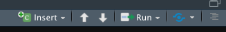
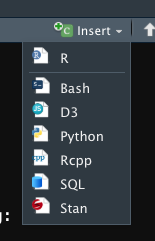

If you are able to open this notebook and render it using knit, then you have successfully done the following: 

- Installed R
- Installed R studio 
- Potentially also have a github account 


### 1. Typical R project structure (Best practices)

- Your project is important and you want everything to be findable and organised well.
- You from past is your best collaborator, so lets get this part right. 
- all data used by scripts should be placed in a folder titled `/data` inside your R project folder
- all scripts and rnotebooks like this go into a folder titled `/scripts`
- all the outputs from your R related work on the project go into folder titled `/output`

You can have more folders serving other purposes but this is a minimum you should do for all your R projects. 


### 2. Lets insert a code section into our notebook.

Lets explore this notebook a bit more. Say you want to add a small chunk where there are R scripts. You then need to do the following: 

- Click on  on the right hand corner of this window
- This opens a dropdown list.
-  Here are the contents of the . 
- The list tells us the types of code chunks we can add to this document. Say we start with an R code chunk. Click on R in the list

```{r}
# This is the output of an R code chunk. Your R commands can live in this box and function normally. 
```


### 3. Cheatsheets

- Programming should not be difficult and therefore developers and community associated with R give you a lot of cheatsheets. You can keep track of these at this [webpage](https://rstudio.com/resources/cheatsheets/)
- This repository has a folder containing some cheatsheets you might find useful. Go over to the `/cheatsheet` folder and explore. 
- Not all commands are useful to you as of today but may come in handy when you are actually working with R during your data analysis. 
- When not able to solve the problem through cheatsheets google them. There is always someone who has had this problem before you. 
- you can add comments to scripts using #. Remove it to uncomment the line. That tells R that its part of the code it needs to run.

### 4. Install packages in R 

To do this inside this notebook you will have to first insert a code chunk to run R. Refer to step 1 of this notebook. This is done by using the command `install.packages(package name)`

```{r}
#Install 'tidyverse' package
#
```

So you have just installed a new package to the R environment. That doesn't mean its available to you for analysis. 

### 5. Activate a package

- To make the package you just installed you need to activate the package in your R environment. We shall do this in the R code chunk below. 
- This is done by using the command `library(package name)`

```{r}
#Load the package you just downloaded.
#
```

### 6. Check if the package is loaded

There are two ways to do this:

1. You could simply tell R to look for it using `search()` - This lists all the packages added to your environment 
2. You could look this up in R studio via a dropdown by pressing `shift+cntrl+4` and navigate to the environment tab. 
3. There you can click on the `Global Environment` dropdown to see the packages included. 
4. Adding a package list to your notebook is recommended. How do we do this. 

```{r}
#See all pacakages installed
#
```

Another good practice at the end of your R session is to check information associated with your session. This can be done by using the function `sessionInfo()`. Render the notebook to see your session information as an HTML output. 

```{r}
#Find out your session info
#
```